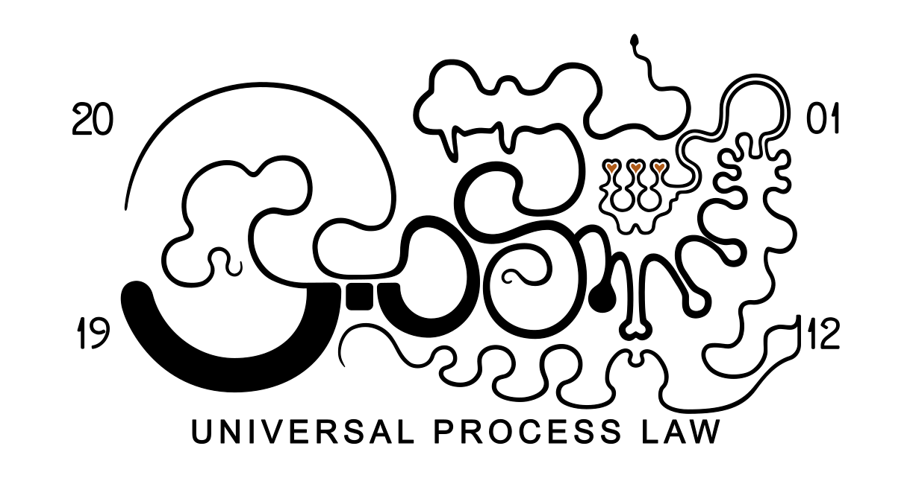

  

# UPL Publications

Public specifications, research publications, operational findings, comparative analyses, exploratory models, and implementation-oriented material related to Universal Process Law (UPL), recursive continuity systems, realization dynamics, observability, adaptive governance, semantic topology, continuity-aware architectures, and evolving AI systems.

This repository serves as a public publication layer containing selected and reconstructable material from ongoing continuity-oriented research and systems development efforts.

## Areas of Focus

- Universal Process Law (UPL)
- realization dynamics and recursive continuity
- continuity-oriented systems architecture
- recursive observability
- continuity-aware governance
- semantic topology and reconstructability
- operational cognition
- adaptive realization systems
- projection-aware architectures
- continuity-sensitive AI systems

## Purpose

The purpose of this repository is to provide publicly accessible publications, specifications, and continuity-oriented research material while preserving bounded separation between public observability surfaces and internal operational implementation environments.

The material spans both theoretical and operational perspectives, including continuity analysis, recursive observability, governance structures, semantic stabilization dynamics, architectural translatability, and implementation-oriented continuity frameworks.

## Website

https://www.universalprocesslaw.com

## Publications

https://www.universalprocesslaw.com/publications

## Notes

The material published here represents evolving continuity-oriented research and architectural exploration. Documents may undergo recursive refinement, extension, stabilization, reinterpretation, or structural expansion over time as the broader lineage develops.

Not all operational systems, implementation structures, governance mechanisms, internal continuity layers, or realization architectures are publicly exposed through this repository.
